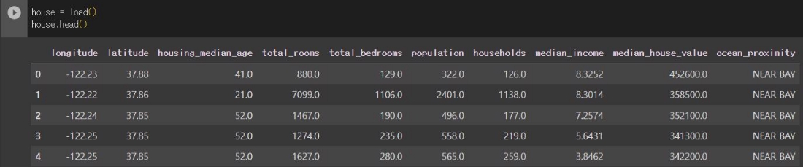
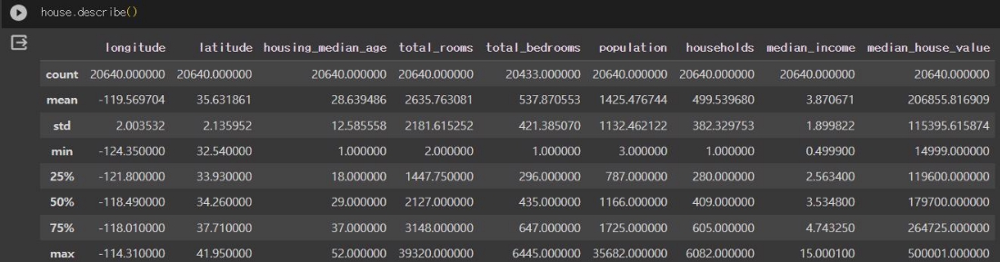
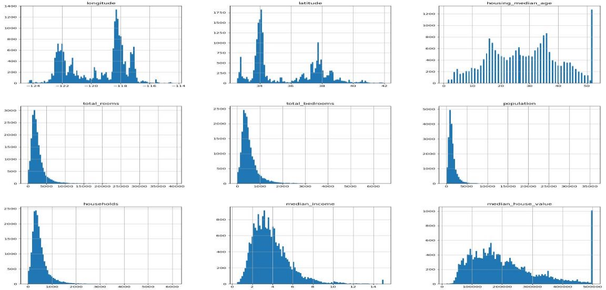
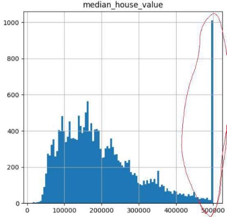
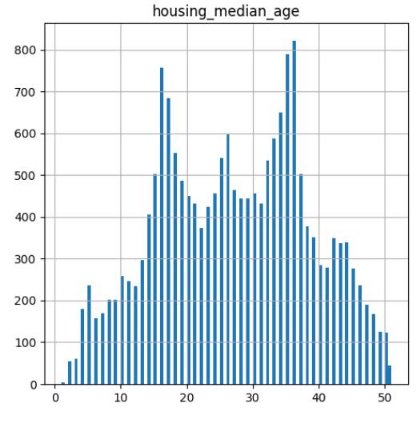
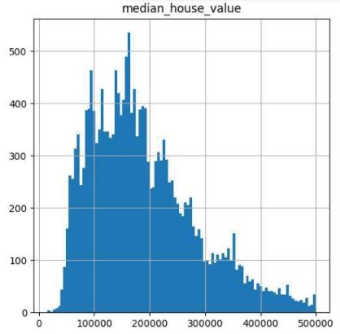
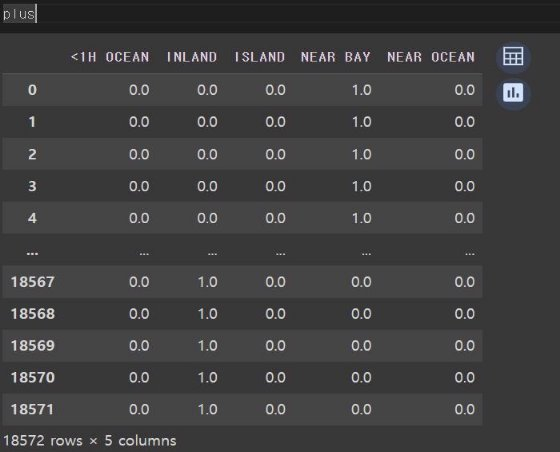
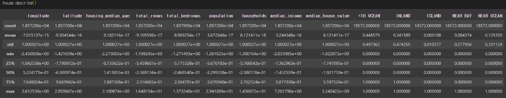
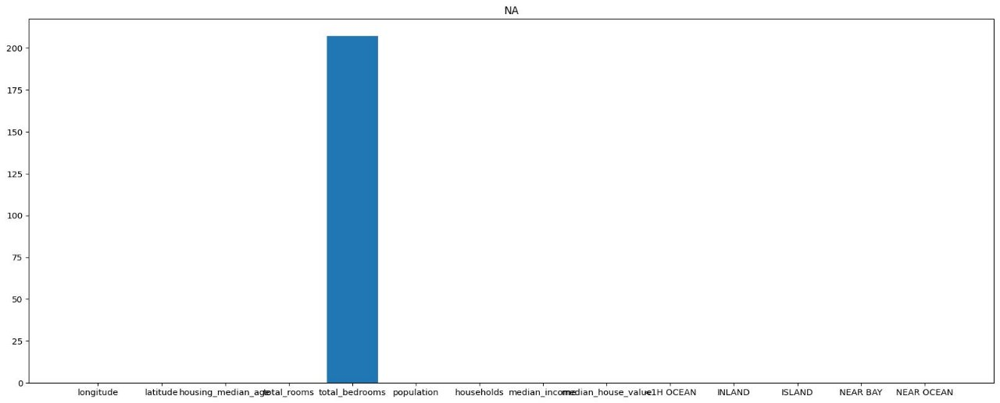
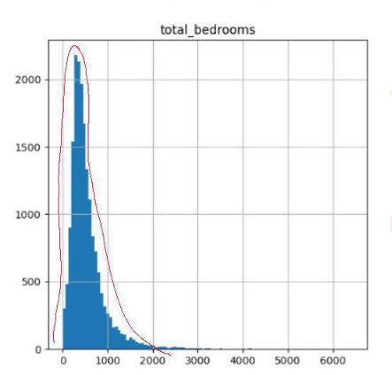

데이터확인

1\.이상치제거

집주인의중앙값, 집값의중앙값이 제한값에몰림

해당구간제거

 

2\.카테고리피처변환

- 카테고리값끼리서로유사도가없음 
- 카테고리타입인 ocean\_proximity를 원-핫인코더(One-hot encoder)로변환 

3\.데이터정규화

- 각특징별단위가다르고불규칙한부분(특이치)가 많으므로특이치에비교적약한 MinMaxScaler대신 StandardScaler 사용

4\.결측치확인

결측치처리

- 결측치(Missing\_Value)를지우기에는 데이터가많고직접다른값을넣기에는 데이터간의패턴이불규칙함 

  (이전값, 이후값넣기는의미가없다고판단또한그래프를보면 알수있듯 0을넣기에는해당값을가지는데이터가적음으로배 제) 

- 그러나표준편차가비교적적고 이상치의영향을적게받을수있는 중앙값이적절하다고판단. 

결과

