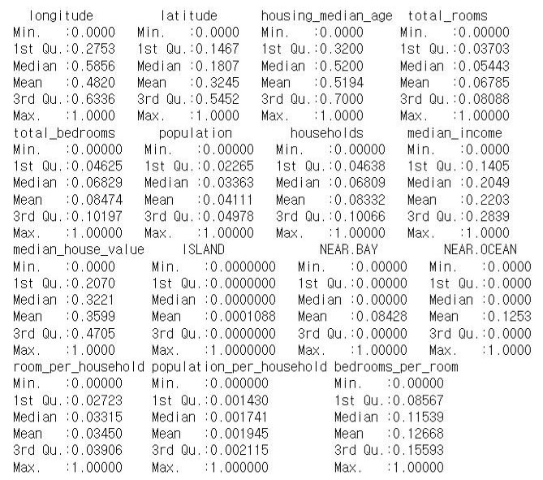
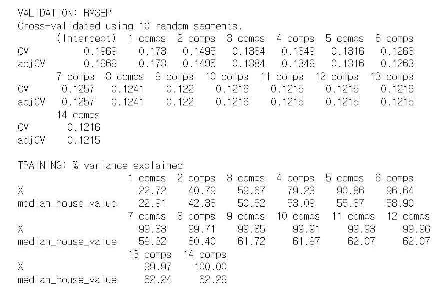
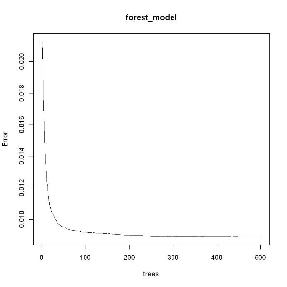

데이터확인

실의개수, 위도, 인구수, 거주자, 해평균안으나이로부, 터전의체상대적인방의개수거, 침리

경도

등등

1. 데이터조합추가
- 가구당평균방의개수 = 해당지역의방의개수 / 가구수
- 모든방중침실의비율=해당지역의침실의개수 / 방의개 수
- 가구당평균인원수= 해당지역의인구수 / 가구수

2. 종속성제거
- 독립변수들간에강한상관관계가나타나는문제
- ex) '몸무게'라는종속변수는 '평균적으로먹은총칼로리', ' 한달동안먹은디저트의개수', '한달동안먹은고기의킬 로수'라는독립변화연관이크다

2-1. 랭크확인

- 일차종속미발견

2-2. 다중공선성확인

- 분산팽창요인(VIF)이가장높은 2개의독립변수 INLAND, X.1H.OCEAN 제거

3. 학습(모든학습과정에적용)
- 변수and PL설정은S 은제외모두) bes(알tsu아서bse차t 사용원을및줄변이수고조합변수끼및리다합치는차항적용PCR 
- cross-val( 사람도과적합대상이므로 k=10,5,3을번갈아가며공 •• 정하게학모수습델있과은음최적의CV정) 규검증에는화가모델된탐색데학이습터및데이터를하이퍼상태만로파라미터사학용습(출력조정값이) 작게나올
- 최종모델선정은 test 데이터로만결정(RMSE 사용)
- 앞과임으로나오는모델들은위의모든과정을거쳐나온최적의결

3-1.선형회귀(+부트스트랩)

특이하게다른모델과는다르게 bestsubset으로 만든결과보다부트 스트랩으로분석해직접만든모델 이 cost가 0.01(RMSE) 정도낮았다 

3-1.선형회귀

- 종정속해변서수작은t9를편제향외일한수록편향더값높들은6개중에서상를수선배 tt1112\* :\* :  --00.0.0000023897848263701 가장낮은값을가지는변수중

  를해주었음 ttt4t923\* :\* :\* :\* : 0-0-00..00.0.0000000011715377791824700261791406960

- RMSE:0.296690793767484

3-2.라쏘and릿지

- 최적의람다:0.001831
- 라쏘<릿지

- RMSE:0.121768353441143

3-3.PCR and PLS

성능 PCR<PLS 

해당결과에서 RMSE는 9에서더이상 하락하지않고오히려증가또한훈련 데이터에서설명된분산도더이상증 가가미미함으로 9개의컴포넌트사 용 

RMSE:0.134896892829038 

트리 and 포레스트and부스팅

포레스트에서트리의수를늘릴때마 다오류률이점점감소함 가지치기는오히려 cost가증가함 

mtry = 3~4 즉현재가지고있는변수 의제곱근을적용했을때가장성능이 좋았음 

RMSE:0.0909237090574371 

하지만부스팅으로최대깊이를 6으로 만들고테스트해보니 

RMSE:0.0878298784001214 

가나왔음 

SVM

- 해결하려는문제가회귀이므로 SVR 모델사용
- RMSE:0.100152216224677
- 최적의하이퍼파라미터
- kernel = "radial"
- cost=5

최종결과

- 최종적으로부스팅이가장높은성능을보였고이후로변수 조합을추가하고제거한결과 RMSE가 0.0878278988513819 까지줄어들었음

원래값과예측값비교

정규화된예측값을다시 비정규화를거친후 테스트데이터와비교 
